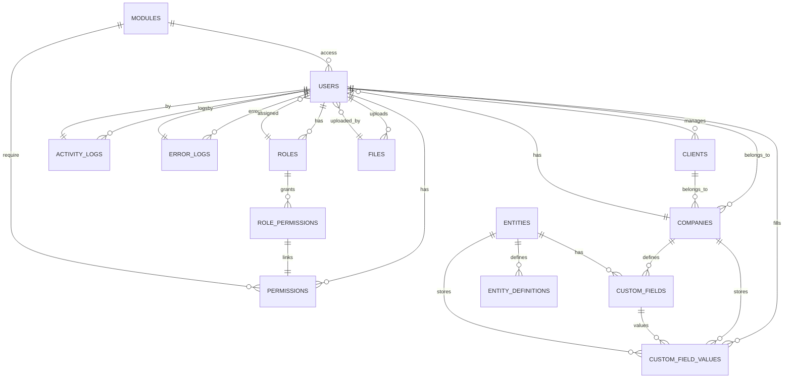

# CRM Base

Sistema base para **Gestión de Relaciones con Clientes (CRM)**, listo para producción y personalización. Incluye backend robusto (NestJS) y frontend moderno (React + Vite), arquitectura modular, autenticación, gestión de usuarios, roles, permisos, módulos, entidades dinámicas y más.

---

## Características Principales

- **Backend (NestJS):**
    - Arquitectura modular y escalable.
    - API RESTful lista para integración.
    - Autenticación y autorización con JWT, roles y permisos.
    - Gestión de usuarios, roles, permisos y módulos.
    - Soporte para campos personalizados y entidades dinámicas.
    - Registro de logs de actividad y errores.
    - Subida y gestión de archivos.
    - Internacionalización (i18n).
    - Preparado para Docker y despliegue en contenedores.

- **Frontend (React + Vite):**
    - Interfaz moderna y responsiva.
    - Manejo de autenticación y sesiones.
    - Gestión de usuarios, compañías, clientes y módulos.
    - Soporte para temas y personalización visual.
    - Componentes reutilizables y estructura escalable.

---

## Módulos y Funcionalidades

- **Usuarios:** Registro, login, gestión de perfiles, cambio de contraseña.
- **Roles y Permisos:** Asignación granular de permisos a roles y usuarios.
- **Clientes y Compañías:** CRUD completo, asociación de clientes a compañías.
- **Campos Personalizados:** Definición y uso de campos dinámicos para entidades.
- **Módulos Dinámicos:** Activación/desactivación de módulos según permisos.
- **Logs de Actividad y Errores:** Auditoría y trazabilidad de acciones y fallos.
- **Gestión de Archivos:** Subida, descarga y almacenamiento seguro de archivos.
- **Internacionalización:** Soporte multilenguaje (español, inglés, etc.).
- **Seguridad:** Autenticación JWT, guardas, validaciones y protección de rutas.

---

## Diagrama General de Entidades (MER)



---

## Estructura del Proyecto

```
crm-base/
│
├── backend/        # Backend NestJS (API, lógica de negocio, módulos)
├── frontend/       # Frontend React + Vite (UI, lógica de cliente)
├── docker/         # Configuración para despliegue en Docker
├── README.md
└── ...
```

---

## Instalación y Uso

### Requisitos

- Node.js >= 18
- pnpm
- Docker (opcional)

### Instalación

1. Clona el repositorio:
    ```bash
    git clone https://github.com/ramirezDg/crm-base.git
    cd crm-base
    ```
2. Instala las dependencias:
    ```bash
    pnpm install
    ```
3. (Opcional) Levanta los servicios con Docker:
    ```bash
    docker compose up -d
    ```

### Uso

- Iniciar backend:
    ```bash
    pnpm run dev
    ```
- Iniciar frontend:
    ```bash
    cd frontend
    pnpm install
    pnpm run dev
    ```

---

## Contribución

¡Las contribuciones son bienvenidas! Abre un issue o pull request para sugerencias o mejoras.

---

## Licencia

MIT

---

**Autor:** ramirezDg
